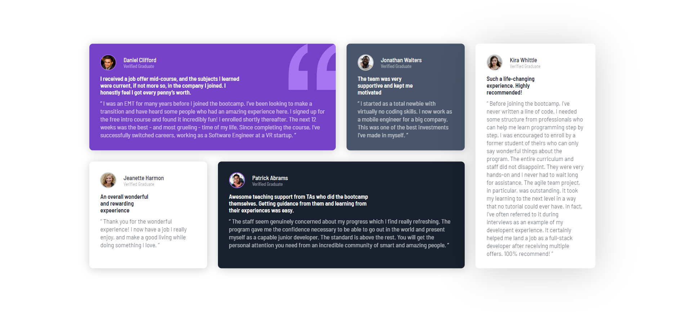

# Welcome to my Webpage of Frontend Mentor - Testimonials grid section solution

This is a solution to the [Testimonials grid section challenge on Frontend Mentor](https://www.frontendmentor.io/challenges/testimonials-grid-section-Nnw6J7Un7). Frontend Mentor challenges help you improve your coding skills by building realistic projects. 

### The challenge

Users should be able to:

- View the optimal layout for the site depending on their device's screen size

### Screenshot

### Links

- Solution URL: (https://github.com/Abubakar-Tamboli/Testimonial-Grid-Section)
- Live Site URL: (https://abubakar-tamboli.github.io/Testimonial-Grid-Section/)

### Built with

- Semantic HTML5 markup
- CSS custom properties
- Flexbox
- CSS Grid
- Media Queries

## Author

- Website - [Abubakar Tamboli ](https://github.com/Abubakar-Tamboli)
- Frontend Mentor - [@Abubakar-Tamboli](https://www.frontendmentor.io/profile/Abubakar-Tamboli)

